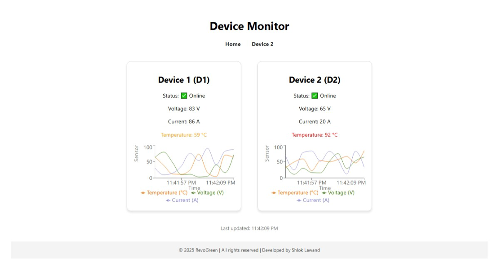
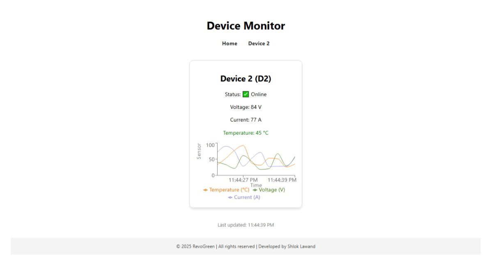

# REACT MINI PROJECT

This is a full-stack project that monitors the status of two devices using a Node.js backend and a React frontend. The backend sends simulated sensor data, and the frontend displays the data in a user-friendly interface.


## Project Structure
```
REACT_MINI_PROJECT_SHLOK/
├── backend/            ← Node.js server
│   ├── server.js
│   ├── package.json
│   └── ...
└── myapp/              ← React frontend
    ├── src/
    ├── public/
    ├── package.json
    └── ...
```
## Tech Stack
- Node.js (Express)
- React.js
- Recharts (for graphs)
- React Router (for navigation)


1.How to Run the Project

Make sure you have Node.js and npm installed on your system.

1.1 Start the Backend Server

The backend simulates device data and serves it at `http://localhost:5000/data`.

commands to be written in the terminal

cd backend
npm install      # Install backend dependencies
node server.js   # Start the backend server


After running this, you should see:


Server running on http://localhost:5000


1.2 Start the Frontend (React App)

In a new terminal window :

cd myapp
npm install      # Install frontend dependencies
npm start        # Start the frontend app


This will open the React app in your browser at:


http://localhost:3000


The app fetches data from the backend every 2 seconds and updates the UI.


## Data Format (from backend)

The backend sends a JSON response at the endpoint `/data` with simulated values for two devices:

Example:

{
  "D1": "D110V15C25T",
  "D2": "D212V20C27T"
}


Each string includes:

(i)D1/D2: Device ID
(ii)VXX: Voltage in Volts
(iii)CXX: Current in Amps
(iv)TXX: Temperature in °C

The frontend parses this string and displays values accordingly.


## Extra points included in the task

(i)The UI also includes hover effects and a dedicated page for Device 2.
(ii)You can navigate using the links at the top.
(iii)Graphs are displayed for both devices.
(iii)Status shows ✅ Online when all values are present, otherwise 🔴 Offline.

## Screenshots
### Dashboard View



### Device 2 Page


## Author
Shlok Lawand
shlok.22211558@viit.ac.in


